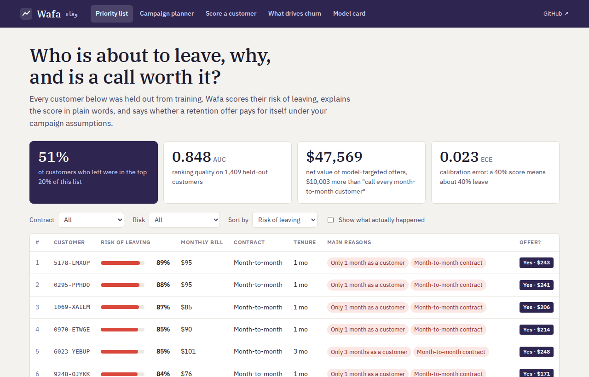
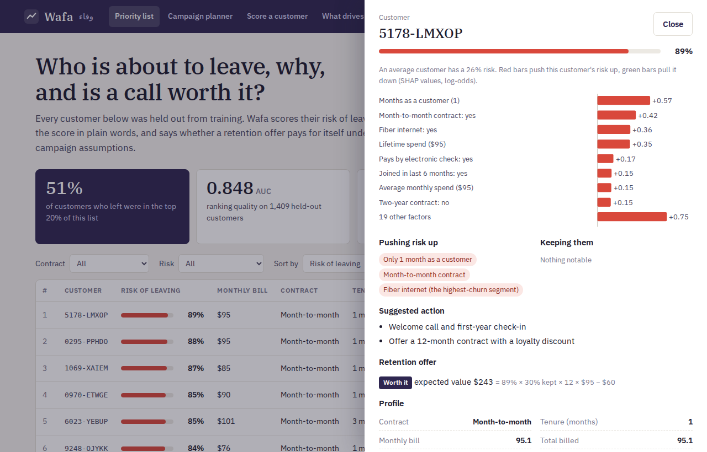
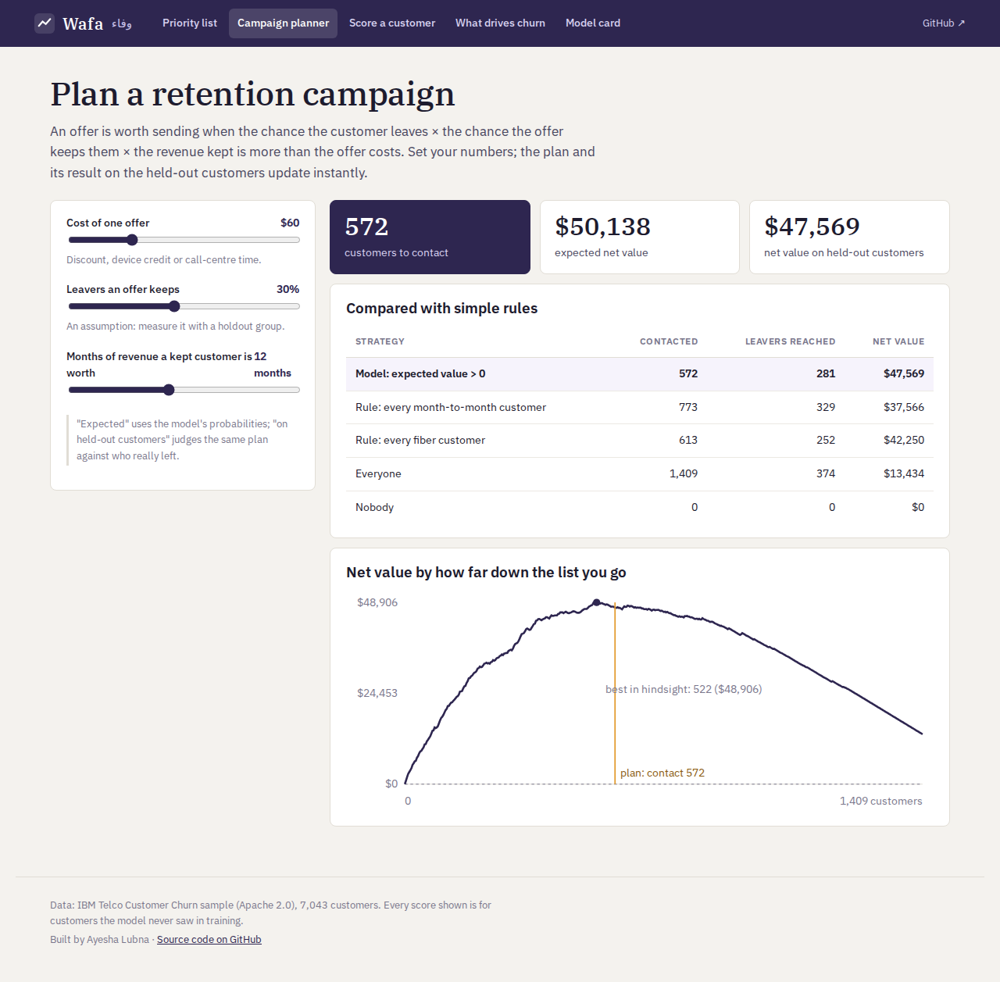

# Wafa وفاء — churn prediction and retention planning

[](https://github.com/Ayshalubna/wafa/actions/workflows/ci.yml)
**[Live demo ↗](https://lubna777-wafa.static.hf.space)** · MIT

A churn model only matters if it changes who the retention team calls. Wafa ranks telecom customers by their risk
of leaving, explains each score in plain words, and recommends a retention offer only when the offer is expected to
pay for itself. It then checks that decision against what actually happened.



## Results

IBM Telco Customer Churn (7,043 customers, 27% churned). Model selection used 5-fold cross-validation on 80% of the
data. **Every number below is on the 1,409 held-out customers.** Full report: [eval/RESULTS.md](eval/RESULTS.md).

| | XGBoost | Logistic regression (baseline) |
|---|---|---|
| ROC-AUC (95% bootstrap CI) | **0.848** (0.826–0.868) | 0.845 (0.823–0.866) |
| Customers who left found in the top 20% of the list | **51%** | 51% |
| Lift in the top 10% | 2.8× | 2.8× |
| Calibration error (ECE) | 0.023 | 0.021 |

**An honest finding:** on this dataset XGBoost and logistic regression are statistically tied (cross-validated AUC
0.849 ± 0.003 vs 0.849 ± 0.005). A few strong, mostly additive signals drive churn here: contract type, tenure,
fiber internet and payment method. XGBoost is kept because it is never worse, can capture interactions between
factors, and gives exact per-customer SHAP explanations. The baseline stays in the report so the choice can be challenged.

**The decision.** An offer is sent when P(churn) × save rate × 12 months of the bill > offer cost. Here the save
rate is 30% and the offer costs $60; both are adjustable. Each strategy was judged against who actually left:

| Strategy | Contacted | Leavers reached | Net value |
|---|---|---|---|
| **Model (expected value > 0)** | 572 | 281 | **$47,569** |
| Every fiber customer | 613 | 252 | $42,250 |
| Every month-to-month customer | 773 | 329 | $37,566 |
| Random, same number of offers | 572 | 160 | $6,384 |
| Everyone | 1,409 | 374 | $13,434 |

The save rate is an assumption, not a measurement. In production it would be measured with a randomised holdout group.

## What's inside

| | |
|---|---|
| **Features in SQL** | [`wafa/sql/features.sql`](wafa/sql/features.sql) turns raw CRM columns into 27 features: contract, payment, add-ons, service count, and the bill compared with the customer's own average. It runs on SQLite. |
| **Model** | XGBoost, tuned by a 30-trial random search with 5-fold CV and early stopping. A logistic-regression baseline is evaluated on the same folds. |
| **Explanations** | Exact TreeSHAP for every customer, turned into plain-language reasons and a suggested action. The wording rules live in [`reasons.json`](wafa/reasons.json) and are shared by Python and JavaScript. |
| **Decision layer** | An expected-value rule for offers, plus a planner that shows the profit curve and compares the model with simple rules. |
| **Fairness check** | Gender is not a model input. AUC and offer rates are reported by gender and by senior status. |
| **API** | FastAPI: `POST /api/score` (one customer plus campaign assumptions → probability, reasons, actions, offer decision), `GET /api/customers`, `GET /api/metrics`. It validates input and applies rate limiting. |
| **In-browser scorer** | [`web/scorer.js`](web/scorer.js) re-implements the trees, TreeSHAP and the feature rules. Tests check it against XGBoost itself (margins and SHAP to 1e-4, features exactly), so the static live demo needs no server. |
| **Quality gates** | `scripts/build` fails if AUC < 0.82, ECE > 0.05, the model campaign stops beating the simple strategies, or XGBoost falls clearly behind the baseline. CI retrains from scratch on every push. |

| Why this customer? | Campaign planner |
|---|---|
|  |  |

## Run it

```bash
pip install -r requirements.txt
python -m scripts.build        # train + evaluate + export (about 2 minutes)
python -m scripts.serve        # http://localhost:8000   (API docs at /docs)
```

Docker: `docker build -t wafa . && docker run -p 8000:8000 wafa`

Tests: `pip install -r requirements-dev.txt && ruff check . && pytest -q`. The scorer tests need Node.js.

Score one customer:

```bash
curl -s localhost:8000/api/score -H 'content-type: application/json' -d '{
  "customer": {"tenure": 3, "Contract": "Month-to-month", "InternetService": "Fiber optic",
               "PaymentMethod": "Electronic check", "MonthlyCharges": 89.5},
  "campaign": {"offer_cost": 60, "save_rate": 0.3, "value_months": 12}}'
```

## Limits

- This is one public, US sample dataset. A real operator would retrain on its own data and monitor drift.
- Predicting who will leave is not the same as predicting who an offer will change (uplift). That needs experiment data.
- Seniors receive more offers because they leave more often, and the model ranks them a little less well (AUC 0.79). Whether that is acceptable is a business decision; the model card makes it visible.

## Data

IBM *Telco Customer Churn* sample data, from [IBM/telco-customer-churn-on-icp4d](https://github.com/IBM/telco-customer-churn-on-icp4d)
(Apache 2.0). It is stored in `wafa/data/`, and its checksum is verified on load.

---

Built by Ayesha Lubna.
